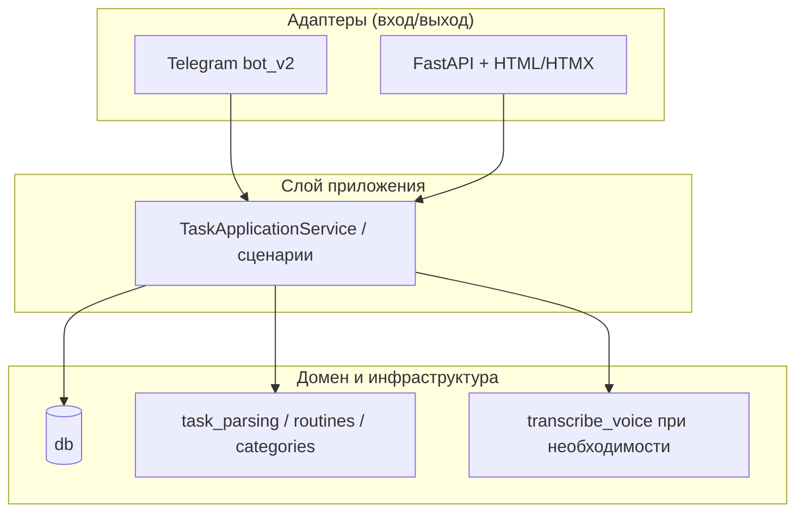

# Веб-интерфейс для помощника по задачам: архитектура и план миграции

Документ задаёт **целевую архитектуру** после отказа от Telegram как основного клиента. Требования: **та же БД и логика**, **бесплатно или символическая плата**, **не обязательно чат** (чекбоксы/кнопки), **голос сохраняется** (ввод речи), управление может быть преимущественно кнопочным.

---

## 1. Анализ текущего состояния

### 1.1. Что уже хорошо отделено

| Слой | Модули | Зависимость от Telegram |
|------|--------|-------------------------|
| Данные | `db.py` | Нет (но идентификация пользователя сейчас через `telegram_id`) |
| Доменные правила | `routines.py`, `task_parsing.py`, `categories.py` | Нет |
| Распознавание речи | `ai_module.transcribe_voice` (Groq Whisper API) | Нет (принимает `bytes`) |
| Форматирование списков/отчётов | Встроено в `bot_v2.py` | **Да** — смешано с хендлерами |

### 1.2. Где зашита Telegram-специфика

- **Точка входа** `bot_v2.py`: `Update`, `MessageHandler`, Markdown-ответы, нумерация «как в последнем сообщении».
- **Пользователь**: `users.telegram_id BIGINT UNIQUE NOT NULL` — веб-пользователь без Telegram сейчас **формально не помещается** в схему без доработки.
- **Голос**: скачивание OGG из Telegram → `transcribe_voice`. Для веба будет **загрузка blob** (WebM/ogg/wav) или **другой путь** (см. §4).

### 1.3. Вывод

Логику задач **не нужно переписывать с нуля**, но нужны:

1. **Слой приложения** (use cases): «добавить задачу», «отметить по глобальному номеру», «отчёт за день» — вход: `user_id` + данные, выход: структурированный результат или готовые фрагменты UI.
2. **Транспортный адаптер** для HTTP (и опционально оставить адаптер Telegram).
3. **Миграция identity** в БД: один внутренний `user_id` — несколько способов входа (Telegram / веб).

---

## 2. Целевая архитектура (гексагональная / порты и адаптеры)

**Принципы:**

- **Порт «входящее действие»** — нормализованная команда: например `AddTaskCommand(text)`, `CompleteByNumbers([1,2,3])`, `GetTodayView()`, а не строка Telegram.
- **Порт «представление»** — для веба: **HTML-фрагменты** или **JSON DTO** для списка задач (id, глобальный номер, заголовок, чекбокс, метки рутины/времени суток). Текст «как в Telegram» не обязателен.
- **Повторное использование**: парсинг текста (`task_parsing`, `routines`) вызывается из сценария «добавить/изменить» одинаково для текста с клавиатуры и для результата распознавания речи.

---

## 3. Веб-UX: не чат, а панель задач

### 3.1. Экраны (MVP)

| Экран | Элементы | Связь с логикой |
|-------|----------|-----------------|
| Сегодня / план | Секции утро/день/вечер, чекбоксы, глобальный номер (подсказка) | `_active_tasks_display_order` + фильтр «сегодня» |
| Все задачи | Таблица/карточки по датам + блок рутин | `_format_task_list` → лучше отдать **список DTO**, шаблон рисует |
| Рутины | Список + действия | `get_routine_tasks` |
| Сделано | Кнопки «Сегодня» / «Неделя» | `_format_done_report_*` → HTML или упрощённые блоки |
| Ввод | Поле текста + **микрофон** + быстрые кнопки («Добавить», «Обновить») | Тот же pipeline, что «сообщение пользователя» в боте |

Чат **не обязателен**: достаточно **одной строки ввода** + голос + кнопки действий над выбранными задачами.

### 3.2. Взаимодействие без SPA-перегруза

Рекомендация для «бесплатно и без заморочек»:

- **Серверный рендер** (Jinja2) + **HTMX** или лёгкий `fetch` для частичного обновления списка после «отметить» / «добавить».
- Минимум JavaScript: чекбоксы привязаны к `task_id` или глобальному номеру, POST на `/api/complete` с CSRF-токеном.

Так проще уложиться в **один контейнер** на бесплатном тарифе и не раздувать фронт.

---

## 4. Голос: стратегия «и дёшево, и похоже на сейчас»

Сейчас: **Whisper через API** (Groq и т.д.) — уже есть в `ai_module.transcribe_voice`.

| Вариант | Плюсы | Минусы |
|---------|-------|--------|
| **A. Загрузка аудио на сервер → тот же `transcribe_voice`** | Одна кодовая база, качество как в Telegram | Нужен ключ API; небольшая стоимость по запросам |
| **B. Web Speech API в браузере** | **$0**, без серверной нагрузки | Качество и русский зависят от браузера; нужен HTTPS |
| **C. Гибрид** | По умолчанию B; кнопка «распознать точнее» → A | Чуть сложнее UI |

**Рекомендация:** **гибрид C** — для «символической платы» основной расход — только Whisper/Groq при явной отправке голоса на сервер; повседневный ввод можно закрыть бесплатным распознаванием в браузере, текст уходит в **тот же** парсер, что и у бота.

Технически на вебе: `MediaRecorder` → короткий webm/wav → `multipart/form-data` → `transcribe_voice(bytes)` (при необходимости конвертация через `ffmpeg`, как в Docker уже есть).

---

## 5. Идентификация пользователей и БД

Сейчас: `telegram_id` обязателен.

**Целевая схема (концептуально):**

- В таблице `users` сделать **`telegram_id` nullable** и добавить уникальное поле, например **`web_auth_sub`** (UUID строки) или **`email`** для веб-аккаунта.
- Либо ввести таблицу **`user_identities(user_id, provider, subject)`** — гибко для Telegram + Web + будущего OAuth.

Для **одного пользователя (личный бот)** MVP-допущение: один секрет в `WEB_SESSION_SECRET` + пароль из env — один фиксированный `user_id` в БД (миграция создаёт пользователя «веб»). Это **ноль заморочек** и **ноль платы** за auth-провайдера.

Мультипользовательский режим — следующий этап (регистрация / magic link).

---

## 6. Хостинг: бесплатно или копейки

| Площадка | Примерно | Замечание для веб+бот-логики |
|----------|----------|------------------------------|
| **Render** (free) | $0 | Web service «засыпает»; для PWA нужен внешний пинг или смириться с задержкой первого запроса |
| **Fly.io** | Free allowance | Часто стабильнее для постоянного процесса; нужен `fly.toml` |
| **Oracle Cloud Always Free** | $0 | VPS под контролем; «символическая плата» только время настройки |
| **БД** | **Neon / Supabase / Railway Postgres** free tier | Уже совместимо с `DATABASE_URL` в `db.py` |

**Рекомендация:** не смешивать «бесплатный веб» с **SQLite на ephemeral диске** в проде — при рестарте контейнера данные пропадут. Для веб-MVP сразу **Postgres** (бесплатный tier).

---

## 7. Безопасность и Россия

- Клиент (браузер) ходит на **ваш HTTPS** за рубежом — типичная схема; блокировки Telegram на использование **вашего сайта** не влияют.
- Админка и деплой (GitHub, панель хостинга) могут требовать обхода только **вам**, не пользователям приложения.

---

## 8. Поэтапный план внедрения

1. **Фаза 0 — подготовка домена в коде**  
   Вынести из `bot_v2` чистые функции представления списков/отчётов в модуль `views_formatting.py` или методы сервиса, принимающие `list[dict]` задач и возвращающие **DTO**, не Markdown для Telegram.

2. **Фаза 1 — миграция пользователей**  
   Alembic/ручные миграции: nullable `telegram_id` + identity для веба или один системный пользователь.

3. **Фаза 2 — FastAPI**  
   Маршруты: `GET /`, `POST /tasks`, `POST /complete`, `POST /voice`, `GET /reports/today`. Сессия cookie.

4. **Фаза 3 — UI**  
   Шаблоны + чекбоксы + HTMX; микрофон + опционально загрузка на Whisper.

5. **Фаза 4 (опционально)**  
   PWA (manifest + service worker) для «как приложение на телефоне».

6. **Telegram**  
   Оставить как опциональный адаптер или отключить, если не нужен.

---

## 9. Итог

- **Архитектурное решение:** один **сервис приложений** поверх `db` + парсеров; **два адаптера** — Telegram и HTTP/HTML.
- **UI:** панель с чекбоксами и кнопками, без обязательного чата.
- **Голос:** браузер (бесплатно) + при необходимости существующий **Whisper** (уже в проекте).
- **Деньги:** $0 на хостинге free tier + Postgres free; ключ Groq для Whisper — **символическая** нагрузка при ограниченном личном использовании.

Дальнейший шаг в коде — **Фаза 0 + Фаза 1** (выделение сервиса и миграция `users`), затем минимальный FastAPI с одной страницей «сегодня» и чекбоксами.

---

## 10. Что потребуется от владельца проекта (ты)

Ниже — то, без чего веб-версию не закрыть, даже если код напишет ассистент или разработчик.

### 10.1. Решения (один раз)

- **Хостинг** — куда выкладываем приложение: Render, Fly.io, Oracle VPS и т.д. (нужна регистрация и доступ в панель).
- **Домен (опционально)** — либо готовый URL вида `xxx.onrender.com`, либо свой домен + DNS (для HTTPS и нормальной работы микрофона в браузере лучше HTTPS).
- **Одна и та же БД** — подтвердить, что **оставляем текущий Postgres** (Supabase/Neon/др.) и готовы **подставить тот же `DATABASE_URL`** в настройках нового сервиса. Если сейчас только SQLite локально — решить: поднять бесплатный Postgres и один раз перенести данные (дамп/скрипт), либо временно SQLite только для тестов (в проде для PaaS лучше Postgres).

### 10.2. Секреты и ключи (положить в env на хостинге)

- **`DATABASE_URL`** — строка подключения к той же БД, что и у бота (если бот ещё крутится параллельно — **одна** БД на двоих процессов — нормально).
- **`TELEGRAM_BOT_TOKEN`** — только если Telegram-бот остаётся включённым рядом с вебом.
- **Ключ для Whisper (голос на сервере)** — как сейчас: например **`GROQ_API_KEY`** (или что уже используется в `ai_module`). Без ключа серверное распознавание отключится; останется только бесплатное распознавание в браузере (если включим в UI).
- **Секрет сессии веба** — например `WEB_SESSION_SECRET` (длинная случайная строка), чтобы куки входа нельзя было подделать.
- **Пароль для входа на сайт (MVP)** — например `WEB_APP_PASSWORD` (один пользователь — ты), пока не сделана полноценная регистрация.

### 10.3. Доступы и аккаунты

- Аккаунт **GitHub** (или другой Git), если деплой идёт из репозитория.
- На хостинге: возможность задать **переменные окружения** и **перезапуск** сервиса после пуша.

### 10.4. От тебя как от пользователя продукта

- **Как входить в веб** — на первом этапе достаточно одного пароля из env; позже можно email/magic link.
- **Нужен ли параллельно Telegram** — если да, тот же `user_id` в БД должен соответствовать и боту, и вебу (это задача миграции identity в коде).
- **Приоритет экранов** — с чего начать: «Сегодня», «Все задачи», «Отчёт» (чтобы не расползаться по объёму MVP).

### 10.5. Что не обязательно сразу

- Собственный домен и почта для «забыли пароль».
- Отдельный платный мониторинг (для free tier иногда хватает встроенных логов хостинга).

Итого: **ты** даёшь хостинг + доступ к БД + список секретов в env + решения по входу и паролю; **разработка** — код FastAPI, шаблоны, HTMX и привязка к существующим `db` / парсерам.
